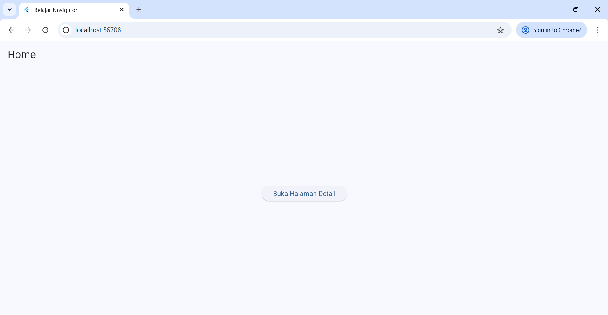
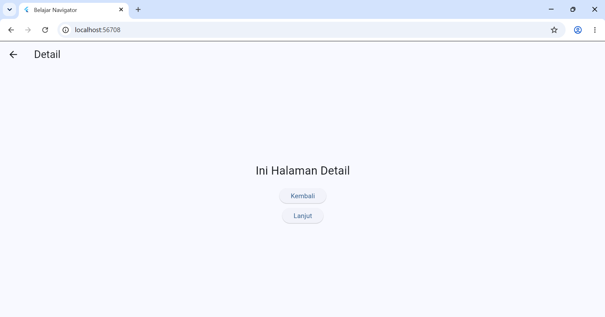
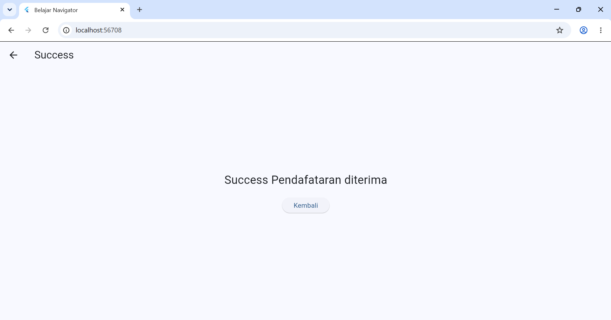
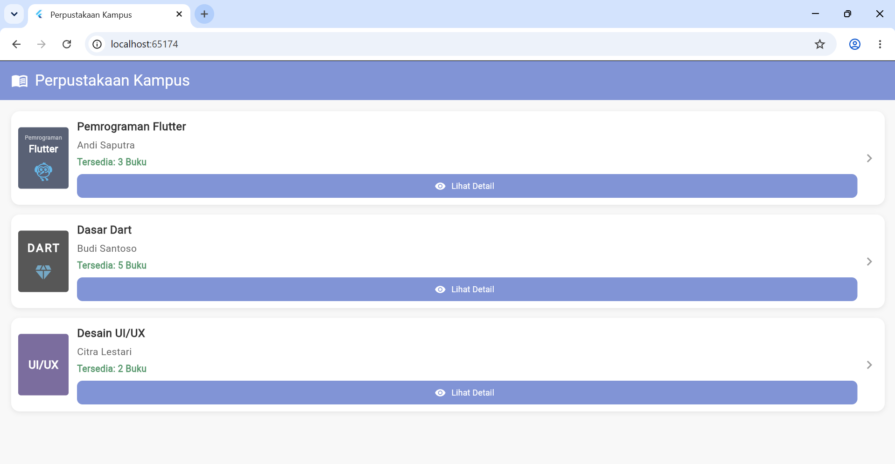
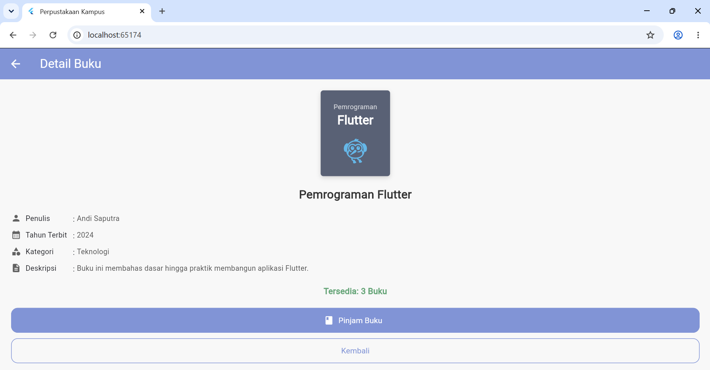
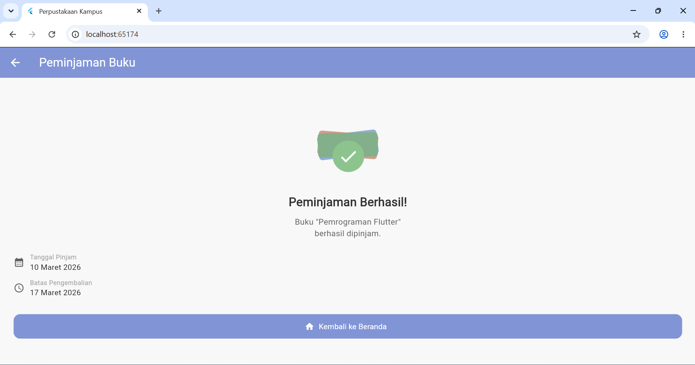

Nama: Elga Maulidia Akbari  
NIM: 362558302130  
Kelas: TRPL 2E

## Praktikum Awal
Pada praktikum awal, dibuat aplikasi Flutter yang menerapkan perpindahan halaman menggunakan Navigator. Praktikum ini terdiri dari beberapa halaman, yaitu halaman Home, halaman Detail, dan halaman Success.

### Home

Pada praktikum awal, dibuat aplikasi Flutter yang menerapkan perpindahan halaman menggunakan Navigator. Praktikum ini terdiri dari beberapa halaman, yaitu halaman Home, halaman Detail, dan halaman Success.

### Detail

Halaman Detail menampilkan informasi lanjutan setelah pengguna melakukan navigasi dari halaman Home.

### Success

Halaman Success menampilkan hasil setelah proses pada halaman sebelumnya berhasil dilakukan.

## Perpustakaan
Pada bagian kedua, aplikasi dikembangkan dengan menambahkan fitur Perpustakaan. Fitur ini menerapkan konsep navigasi antarhalaman untuk menampilkan informasi dan proses yang terdapat pada aplikasi perpustakaan.

### Home

Halaman Home Perpustakaan merupakan halaman utama dari fitur perpustakaan. Pada halaman ini pengguna dapat melihat tampilan awal dan melakukan navigasi ke halaman berikutnya.

### Detail

Halaman Detail Perpustakaan menampilkan informasi yang lebih lengkap dari fitur atau data yang dipilih oleh pengguna.

### Success

Halaman Success Perpustakaan menampilkan halaman setelah proses yang dilakukan pengguna berhasil.

